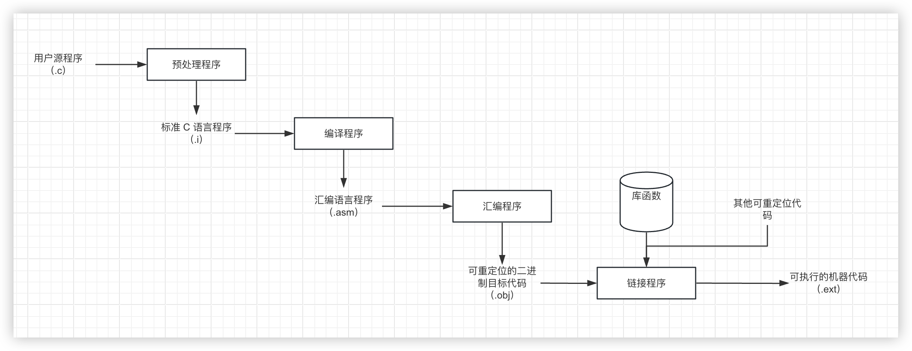

# 第一章编译概述

##  知识点

### 1.1 程序设计语言及翻译程序

#### 1.1.1程序设计语言的发展

1. 第一个描述算法的语言（`FORTRAN` 语言）

####  1.1.2 翻译程序大家族 

1. `翻译程序：`

> 可以把一种语言书写的程序翻译成另一种语言书写的程序的程序统称为翻译程序。一般来说翻译前后的程序在逻辑上是`等价`的

3. 程序设计语言按照离计算机硬件的远近分成三个层次：`高级语言层、汇编语言层、机器语言层`

4. 能将一种高级语言翻译为另一种高级语言的程序称为`转换程序`
5. 高级语言编译程序有两种翻译方式：`直接翻译为机器语言程序和先翻译为汇编语言程序在翻译为机器语言程序`
6. 汇编程序将汇编语言程序翻译为机器语言程序，反汇编程序把机器语言程序逆向翻译为汇编语言程序
7. `交叉编译程序：`能把一种计算机上的高级语言程序翻译为另一种计算机上的汇编语言或机器语言程序

#### 1.1.3高级语言的运行方式

1. `编译方式：`

   > 利用编译程序将高级语言程序翻译为机器语言程序，然后再运行这个机器语言程序

2. `解释方式：`

   > 利用解释程序直接读取高级语言程序中的每个语句，翻译并直接执行

3. `编译方式与解释方式比较:`

   > 1. `编译程序`是源程序的一个`转换系统`，`解释程序`是源程序的一个`执行系统`。编译程序的工作结果是等价于源程序的某机器语言程序；解释程序的工作结果是源程序的执行结果
   > 2. 编译程序先把全部源程序翻译为目标程序，该目标程序可以`反复执行`；解释程序对源程序逐句地翻译执行，目标代码只能执行一次，若需要重新执行，则必须`重新解释源程序`
   > 3. 解释程序一般程序一般用高级语言编写，能够在绝大多数类型的计算机上运行
   > 4. 通过`编译`运行，源程序和数据是在`不同的时间`进行处理的，通过`解释`运行，源程序和数据是`同时处理`的
   > 5. 编译方式比解释方式执行快得多，因为编译方式在程序运行阶段就不需要在分析了，而解释器的错误诊断效果通常比编译器更好，因为它逐条语句地执行源程序；变成语言的执行方式是可以自由选择的
   > 6. `静态类型检查:`在程序执行前需要对`函数的返回值`、`变量的类型`、`数组下标的范围`、`参数的类型`等进行类型检查的方式。Java 语言采取一种折中的执行方式：`编译 + 解释`
   > 7. 专门用于帮助程序开发和调试的编译程序，成为`诊断编译程序`；着重于提高目标代码效率的编译程序，称为`优化编译程序`。运行编译程序的计算机成为`宿主机`，运行编译代程序所产生的目标代码的计算机称为`目标机`。如果不需要重写编译程序中与机器无关的部分就能改变目标机，则称该编译程序为`可变目标编译程序`

### 1.2编译系统

编译程序能够将高级语言程序翻译为汇编语言程序，进而翻译为机器语言程序

#### 1.2.1 高级语言编译流程

经过 4个阶段：`预处理、编译、汇编和链接`。它首先对 C 语言的源程序进行`预处理`，将其中的`宏和预处理命令`展开转换为`标准 C 语言程序`，然后进行`编译`，生成`汇编语言程序`，在经过汇编程序汇编生成`二进制目标代码`，最后对目标代码进行`链接`，此时需要将相关的库函数和外部程序一起链接，生成`可执行的机器代码`

> 1. `预处理：`C语言预处理的结果是标准的 C 语言程序，在 VC++6.0 中，通过预处理后，将`.C`的源程序变为了`.i`的文本文件
> 2. `编译：`编译的结果是某种机器上汇编语言写的程序。在 VC++6.0 中，编译这一步将`.i`的文本文件生成了`.cod`的文本文件这就是汇编代码。有的编译器生成以`.s或.asm`为扩展名的文件
> 3. `汇编：`汇编语言程序需要由汇编程序翻译为二进制的目标代码。大多数编译器生成的目标代码是扩展名为`.obj`的二进制文件
> 4. `链接：`VC++6.0 编辑器在链接后生成的文件是扩展名为`.exe`的可执行文件；通过链接生成的不一定都是可执行程序，也可以是`程序库文件`；
>    1. `广义的编译：`将 C 语言转化为机器语言程序的整个过程，包括上述四个阶段，指的是整个编译系统
>    2. `狭义的编译：`上面四个阶段中的编译阶段，将 C 语言程序翻译为汇编语言程序的过程
> 5. 预处理程序、编译程序、汇编程序、链接程序统称为语言处理程序

#### 1.2.2高级语言编译实例

> `动态连接和静态连接：`
>
> 编程时使用了一部分库文件中的代码，在最终生成可执行代码时还需将库文件中那部分代码拼装进来才能完整运行。这就是`链接器`的功能

> `静态链接方式：`把公共库内的代码合并到可执行文件内部，使得`可执行文件的体积变得庞大`
>
> `不足：`
>
> 1. 会导致可执行文件版本难以控制，如果库更新了，可执行文件`得不到及时更新`
> 2. 如果有多个程序调用相同的公用库函数，运行时这些共用库函数的代码在内存中将有`多份副本`，`占用了多余的内存空间`
>
> `动态链接方式：`不会把公用库文件代码合并到可执行文件内，而仅仅纪录动态链接库的`路径信息`，它允许程序在`运行前`才加载所需的动态链接库，如果该动态链接库已加载到内存，则`不需要重复加载`
>
> `不足：`运行时加载会`增加程序执行的时间开销`，如果动态链接库的版本错误则可`能会导致程序无法执行`

## 1.3编译过程和编译程序的结构

#### 1.3.1 编译过程概述

编译程序的工作过程划分为：`词法分析、语法分析、语义分析、目标代码`

> 1. `词法分析：`编译程序工作之前，需要将用`高级语言书`写的源程序作为`输入`，词法分析的任务是：从`左到右扫描输入的源程序，检查词法错误，识别出正确的单词，并输入单词的内部表示形式，成为单词记号`
>
>    单词：关键字、标识符、常数、运算符、界符（标点符号、括号、注释）
>
> 2. `语法分析：`在词法分析的基础上将单词组成各类语法单位，如`表达式`、`语句`、`程序`等，通过分析确定整个输入串是否具有语法上的正确的程序结构，如果不是，则`给出语法错误`，并尽可能地继续检查，
>
>    `单词记号按层次分组`
>
>    语言规则通常由`递归规则`来定义
>
>    1. 标识符 = 表达式
>    2. 任何标识符都是表达式
>    3. 任何常数是表达式
>    4. 若表达式 1 和表达式 2 都是表达式，则表达式 1 + 表达式 2、表达式 1*表达式 2 都是表达式，即表达式的运算也是表达式
>
>    语法分析过程可以用一棵树来表示通常称为`语法分析树`，简称`语法树`
>
>    用递归方式来表示语法结构构成的规则称为`上下文无关文法`，所有单词记号都出现在树的叶子节点上，在语法分析中称为`终结符`，所有的非叶子节点都是对一串单词记号的抽象概括，称为`非终结符`
>
> 3. `语义分析：`源程序中的符号主要有两种存在形式：`变量和函数`
>
>    `变量`是`数据`的`符号化形式`，`函数`是`代码`的`符号化形式`
>
>    `符号信息`的`准确`和`完整`是进行语义分析和代码生成的依据
>
>    符号表需要根据`作用域的变化动态维护变量的可见性`
>
>    `静态语义检查：`
>
>    1. 变量和函数使用前是否`定义`
>    2. 变量赋值的类型是否`兼容`
>    3. 数组`维数`是否相同，数组`下标`是否越界
>    4. `return` 语句返回的类型和函数返回值得的类型是否兼容
>    5. `break`、`continue` 语句的使用是否合适
>    6. 函数调用时参数列表是否兼容
>
> 4. `目标代码生成：`编译的最后一个阶段，根据识别的`语法单位翻译出目标机的指令`
>
>    由程序语法结构驱动进行代码生成的方法称为`语法制导翻译`（Syntax-directed Translation `SDT`）。这种方式的翻译中，需要对语法树中的每个`非终结符`（即语法单位，语法树的内部特点）都进行翻译生成相应的目标代码。一般来说，代码生成需要根据语言的语法规则，对下述语法单位进行翻译
>
>    1. 表达式
>    2. 赋值语句
>    3. if、for、while、do……while 等语句
>    4. 复合语句
>    5. 函数的定义与调用
>    6. 其他一些语法结构
>
> 5. `中间代码生成：`现代编译器为了实现`优化`功能，需要设计一种中间代码，它是一种`含义明确、便于处理的记号系统。`
>
>    多数编译程序采用`四元式`形式的中间代码
>
>    `（运算符，运算对象1，预算对象2，结果）`
>
> 6. `代码优化：`对产生的中间代码进行`等价变换`，以产生高质量的目标代码。优化的目的主要是`提高运行速度，节省存储空间`。优化主要有两类：一类是与`机器有关的优化`，主要涉及如何`分配寄存器`、如何`选择指令`，在这类优化是在`生成目标代码`时进行的；另一类优化与机器无关，主要是对`中间代码的优化`，这类优化主要有`局部优化`、`循环优化`和`全局优化`

#### 1.3.2编译程序的结构

> 1. `词法分析器（Scanner，扫描器）：``读入源程序，进行词法分析，输出单词记号`
>
> 2. `语法分析器（Parser，解析器）：`对`单词记号串进行语法分析`，`识别出各类语法单位`，最终判断输入串是否构成`语法上正确`的程序
>
> 3. `语义分析器（Semantic Analyzer）：`将各种符号的必要信息填`入符号表`，并按照语义规则对语法分析器识别出的语法单位进行`静态语义检查`
>
> 4. `中间代码生成器（Intermediate Code Generator）：`的功能是将语法分析器识别出的各个语法单位翻译成一定形式的`中间代码`
>
> 5. `代码优化器（Optimizer）：`的功能是对生成的`中间代码进行优化处理`
>
> 6. `目标代码生成器（Target Code Generator）：` 的功能是把中间代码或优化后的中间代码`翻译为目标代码`，如果没有优化器，目标代码生成器也可以从识别出的`语法单位直接生成目标代码`
>
>    此外，一个完整的编译程序还必须包括错误处理程序和表格管理程序两部分
>
>    `源程序中的错误：`
>
>    1. `字符错误：`源程序中出现了`非法字符`。这类错误一般在词法分析阶中一起检测
>    2. `词法错误：`不符合单词构成规则的错误，如`单词拼写错误`
>    3. `语法错误：`源程序中不符合语法规则的错误，如算`数表达式中括号不匹配`、`缺少运算对象`、`缺少“ ：”`等
>    4. `语义错误：`源程序中不符合语义规则的错误，如`运算量的类型不相容`、`实参和形参不匹配`等。这些错误一般在语义分析时被检测出来
>    5. `逻辑错误：`程序本身`逻辑上`有问题，如无`穷的递归调用`

错误处理功能不应该明显影响对`正确程序的处理效率`

编译过程中`最重要`的表格是`符号表`，用来`登记源程序中出现的每个符号以及它们的各种属性`

> `词法分析`是实现编译器的`基础`；`语法分析`是实现编译器的`关键`；它可以分析出源程序的语法结构是否正确；`语义分析`是对源程序`正确性`的最后一次检查，只有源程序语义上没有问题，才能进行正确的翻译。`符号表`在`语义分析`阶段建立，将在后续几个阶段中使用，并填入`新的属性值`

## 课后习题

1. 解释下列术语

   1. `翻译程序`：

      > 可以把一种语言书写的程序翻译为另一种语言书写的程序，一般来说翻译前后的程序在逻辑上是等价的

   2. `编译程序：`

      > 

   3. 解释程序

   4. 源程序

   5. 目标程序

   6. 遍

   7. 前端

   8. 后端

2. 高级语言程序有哪两种执行方式？阐述其主要异同点，描述编译方式执行程序的过程

3. 在你所使用的 C 语言编译器中，观察程序 1.1 经过预处理、编译、汇编、链接四个过程生成的中间结果

4. 编译程序有哪些主要构成部分？各自的主要功能是什么

5. 编译程序的构造需要掌握哪些原理和技术？编译程序构造工具的作用是什么？

6. 复习 C 语言其字母表中有哪些符号？有哪些关键字、运算符和界符？标识符、整数和实数的构成规则是怎样的？各种语句和表达式的结构是怎样的

7. 编译技术可应用在哪些领域

8. 你能解释在 Java 编译器中，输入某个符号后会提示一些单词，某些单词变为不同的颜色是如何实现的吗？你能解释在 Code Blocks 中输入{ 后会自动添加 } ，输入 do 会自动添加 while() 是为什么吗

