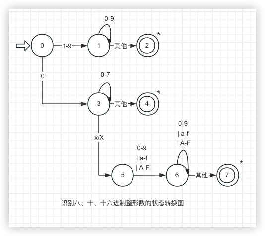

# 第一章编译概述

## 1.1 程序设计语言及翻译程序

### 1.1.1程序设计语言的发展

1. 第一个描述算法的语言（`FORTRAN` 语言）

###  1.1.2 翻译程序大家族 

1. `翻译程序：`

> 可以把一种语言书写的程序翻译成另一种语言书写的程序的程序统称为翻译程序。一般来说翻译前后的程序在逻辑上是`等价`的

3. 程序设计语言按照离计算机硬件的远近分成三个层次：`高级语言层、汇编语言层、机器语言层`

4. 能将一种高级语言翻译为另一种高级语言的程序称为`转换程序`
5. 高级语言编译程序有两种翻译方式：`直接翻译为机器语言程序和先翻译为汇编语言程序在翻译为机器语言程序`
6. 汇编程序将汇编语言程序翻译为机器语言程序，反汇编程序把机器语言程序逆向翻译为汇编语言程序
7. `交叉编译程序：`能把一种计算机上的高级语言程序翻译为另一种计算机上的汇编语言或机器语言程序

### 1.1.3高级语言的运行方式


1. `编译方式：`

   > 利用编译程序将高级语言程序翻译为机器语言程序，然后再运行这个机器语言程序

2. `解释方式：`

   > 利用解释程序直接读取高级语言程序中的每个语句，翻译并直接执行

3. `编译方式与解释方式比较:`

   > 1. `编译程序`是源程序的一个`转换系统`，`解释程序`是源程序的一个`执行系统`。编译程序的工作结果是等价于源程序的某机器语言程序；解释程序的工作结果是源程序的执行结果
   > 2. 编译程序先把全部源程序翻译为目标程序，该目标程序可以`反复执行`；解释程序对源程序逐句地翻译执行，目标代码只能执行一次，若需要重新执行，则必须`重新解释源程序`
   > 3. 解释程序一般程序一般用高级语言编写，能够在绝大多数类型的计算机上运行
   > 4. 通过`编译`运行，源程序和数据是在`不同的时间`进行处理的，通过`解释`运行，源程序和数据是`同时处理`的
   > 5. 编译方式比解释方式执行快得多，因为编译方式在程序运行阶段就不需要在分析了，而解释器的错误诊断效果通常比编译器更好，因为它逐条语句地执行源程序；变成语言的执行方式是可以自由选择的
   > 6. `静态类型检查:`在程序执行前需要对`函数的返回值`、`变量的类型`、`数组下标的范围`、`参数的类型`等进行类型检查的方式。Java 语言采取一种折中的执行方式：`编译 + 解释`
   > 7. 专门用于帮助程序开发和调试的编译程序，成为`诊断编译程序`；着重于提高目标代码效率的编译程序，称为`优化编译程序`。运行编译程序的计算机成为`宿主机`，运行编译代程序所产生的目标代码的计算机称为`目标机`。如果不需要重写编译程序中与机器无关的部分就能改变目标机，则称该编译程序为`可变目标编译程序`

## 1.2编译系统

编译程序能够将高级语言程序翻译为汇编语言程序，进而翻译为机器语言程序

### 1.2.1 高级语言编译流程


经过 4个阶段：`预处理、编译、汇编和链接`。它首先对 C 语言的源程序进行`预处理`，将其中的`宏和预处理命令`展开转换为`标准 C 语言程序`，然后进行`编译`，生成`汇编语言程序`，在经过汇编程序汇编生成`二进制目标代码`，最后对目标代码进行`链接`，此时需要将相关的库函数和外部程序一起链接，生成`可执行的机器代码`

> 1. `预处理：`C语言预处理的结果是标准的 C 语言程序，在 VC++6.0 中，通过预处理后，将`.C`的源程序变为了`.i`的文本文件
> 2. `编译：`编译的结果是某种机器上汇编语言写的程序。在 VC++6.0 中，编译这一步将`.i`的文本文件生成了`.cod`的文本文件这就是汇编代码。有的编译器生成以`.s或.asm`为扩展名的文件
> 3. `汇编：`汇编语言程序需要由汇编程序翻译为二进制的目标代码。大多数编译器生成的目标代码是扩展名为`.obj`的二进制文件
> 4. `链接：`VC++6.0 编辑器在链接后生成的文件是扩展名为`.exe`的可执行文件；通过链接生成的不一定都是可执行程序，也可以是`程序库文件`；
>    1. `广义的编译：`将 C 语言转化为机器语言程序的整个过程，包括上述四个阶段，指的是整个编译系统
>    2. `狭义的编译：`上面四个阶段中的编译阶段，将 C 语言程序翻译为汇编语言程序的过程
> 5. 预处理程序、编译程序、汇编程序、链接程序统称为语言处理程序

### 1.2.2高级语言编译实例


> `动态连接和静态连接：`
>
> 编程时使用了一部分库文件中的代码，在最终生成可执行代码时还需将库文件中那部分代码拼装进来才能完整运行。这就是`链接器`的功能


> `静态链接方式：`把公共库内的代码合并到可执行文件内部，使得`可执行文件的体积变得庞大`
>
> `不足：`
>
> 1. 会导致可执行文件版本难以控制，如果库更新了，可执行文件`得不到及时更新`
> 2. 如果有多个程序调用相同的公用库函数，运行时这些共用库函数的代码在内存中将有`多份副本`，`占用了多余的内存空间`
>
> `动态链接方式：`不会把公用库文件代码合并到可执行文件内，而仅仅纪录动态链接库的`路径信息`，它允许程序在`运行前`才加载所需的动态链接库，如果该动态链接库已加载到内存，则`不需要重复加载`
>
> `不足：`运行时加载会`增加程序执行的时间开销`，如果动态链接库的版本错误则可`能会导致程序无法执行`

## 1.3编译过程和编译程序的结构

### 1.3.1 编译过程概述

编译程序的工作过程划分为：`词法分析、语法分析、语义分析、目标代码`

> 1. `词法分析：`编译程序工作之前，需要将用`高级语言书`写的源程序作为`输入`，词法分析的任务是：从`左到右扫描输入的源程序，检查词法错误，识别出正确的单词，并输入单词的内部表示形式，成为单词记号`
>
>    单词：关键字、标识符、常数、运算符、界符（标点符号、括号、注释）
>
> 2. `语法分析：`在词法分析的基础上将单词组成各类语法单位，如`表达式`、`语句`、`程序`等，通过分析确定整个输入串是否具有语法上的正确的程序结构，如果不是，则`给出语法错误`，并尽可能地继续检查，
>
>    `单词记号按层次分组`
>
>    语言规则通常由`递归规则`来定义
>
>    1. 标识符 = 表达式
>    2. 任何标识符都是表达式
>    3. 任何常数是表达式
>    4. 若表达式 1 和表达式 2 都是表达式，则表达式 1 + 表达式 2、表达式 1*表达式 2 都是表达式，即表达式的运算也是表达式
>
>    语法分析过程可以用一棵树来表示通常称为`语法分析树`，简称`语法树`
>
>    用递归方式来表示语法结构构成的规则称为`上下文无关文法`，所有单词记号都出现在树的叶子节点上，在语法分析中称为`终结符`，所有的非叶子节点都是对一串单词记号的抽象概括，称为`非终结符`
>
> 3. `语义分析：`源程序中的符号主要有两种存在形式：`变量和函数`
>
>    `变量`是`数据`的`符号化形式`，`函数`是`代码`的`符号化形式`
>
>    `符号信息`的`准确`和`完整`是进行语义分析和代码生成的依据
>
>    符号表需要根据`作用域的变化动态维护变量的可见性`
>
>    `静态语义检查：`
>
>    1. 变量和函数使用前是否`定义`
>    2. 变量赋值的类型是否`兼容`
>    3. 数组`维数`是否相同，数组`下标`是否越界
>    4. `return` 语句返回的类型和函数返回值得的类型是否兼容
>    5. `break`、`continue` 语句的使用是否合适
>    6. 函数调用时参数列表是否兼容
>
> 4. `目标代码生成：`编译的最后一个阶段，根据识别的`语法单位翻译出目标机的指令`
>
>    由程序语法结构驱动进行代码生成的方法称为`语法制导翻译`（Syntax-directed Translation `SDT`）。这种方式的翻译中，需要对语法树中的每个`非终结符`（即语法单位，语法树的内部特点）都进行翻译生成相应的目标代码。一般来说，代码生成需要根据语言的语法规则，对下述语法单位进行翻译
>
>    1. 表达式
>    2. 赋值语句
>    3. if、for、while、do……while 等语句
>    4. 复合语句
>    5. 函数的定义与调用
>    6. 其他一些语法结构
>
> 5. `中间代码生成：`现代编译器为了实现`优化`功能，需要设计一种中间代码，它是一种`含义明确、便于处理的记号系统。`
>
>    多数编译程序采用`四元式`形式的中间代码
>
>    `（运算符，运算对象1，预算对象2，结果）`
>
> 6. `代码优化：`对产生的中间代码进行`等价变换`，以产生高质量的目标代码。优化的目的主要是`提高运行速度，节省存储空间`。优化主要有两类：一类是与`机器有关的优化`，主要涉及如何`分配寄存器`、如何`选择指令`，在这类优化是在`生成目标代码`时进行的；另一类优化与机器无关，主要是对`中间代码的优化`，这类优化主要有`局部优化`、`循环优化`和`全局优化`

### 1.3.2 编译程序的结构

> 1. `词法分析器（Scanner，扫描器）：``读入源程序，进行词法分析，输出单词记号`
>
> 2. `语法分析器（Parser，解析器）：`对`单词记号串进行语法分析`，`识别出各类语法单位`，最终判断输入串是否构成`语法上正确`的程序
>
> 3. `语义分析器（Semantic Analyzer）：`将各种符号的必要信息填`入符号表`，并按照语义规则对语法分析器识别出的语法单位进行`静态语义检查`
>
> 4. `中间代码生成器（Intermediate Code Generator）：`的功能是将语法分析器识别出的各个语法单位翻译成一定形式的`中间代码`
>
> 5. `代码优化器（Optimizer）：`的功能是对生成的`中间代码进行优化处理`
>
> 6. `目标代码生成器（Target Code Generator）：` 的功能是把中间代码或优化后的中间代码`翻译为目标代码`，如果没有优化器，目标代码生成器也可以从识别出的`语法单位直接生成目标代码`
>
>    此外，一个完整的编译程序还必须包括错误处理程序和表格管理程序两部分
>
>    `源程序中的错误：`
>
>    1. `字符错误：`源程序中出现了`非法字符`。这类错误一般在词法分析阶中一起检测
>    2. `词法错误：`不符合单词构成规则的错误，如`单词拼写错误`
>    3. `语法错误：`源程序中不符合语法规则的错误，如算`数表达式中括号不匹配`、`缺少运算对象`、`缺少“ ：”`等
>    4. `语义错误：`源程序中不符合语义规则的错误，如`运算量的类型不相容`、`实参和形参不匹配`等。这些错误一般在语义分析时被检测出来
>    5. `逻辑错误：`程序本身`逻辑上`有问题，如无`穷的递归调用`

错误处理功能不应该明显影响对`正确程序的处理效率`

编译过程中`最重要`的表格是`符号表`，用来`登记源程序中出现的每个符号以及它们的各种属性`

> `词法分析`是实现编译器的`基础`；`语法分析`是实现编译器的`关键`；它可以分析出源程序的语法结构是否正确；`语义分析`是对源程序`正确性`的最后一次检查，只有源程序语义上没有问题，才能进行正确的翻译。`符号表`在`语义分析`阶段建立，将在后续几个阶段中使用，并填入`新的属性值`


### 1.3.3编译阶段的组合

> 按照编译程序各个阶段的执行过程和所完成的任务，有时将编译过程的各个阶段组合为`编译前端`（Front End）和`后端`（Back End）。编译前端部分包括`词法分析`、`语法分析`、`语义分析`、`中间代码生成`，以及`部分代码优化`工作，是对`源程序`进行分析的过程。它主要与`源语言有关`，`与目标机无关`，主要根据源语言的定义静态分析源程序的结构，以检查是否符合语言的规定，确定源程序所表示的对象和规定的操作，并以某种中间形式表示出来。编译后端包括`部分代码优化`和`目标代码生成`，是对分析过程的综合，与`源语言无关`，依赖于`中间语言和目标机`，主要是根据分析的结果构造出目标程序。


> 这样就可以取某一编译程序的`前端`，配上`不同的后端`，构成同一源语言在不同机型上的编译程序；用不同的`前端`，配上一个`共同的后端`，就可以为`同一机器生成几种语言的编译程序`。如果出现一种`新的语言`，只要构造一个`新的前端`，将该前端与`已存在的后端整合`，即可构成`新语言在各种机器上的编译程序`；对一种`新机器`，只需构造一个`新的后端`，与`已存在的前端`整合，即可构成所有语言在新机器上的编译程序。这样大大简化了编译程序的构造工作


> 编译的 6 个阶段和前后端都是从`逻辑`上划分的，在具体实现时，受`不同语言`、`设计要求`、`开发环境`和`内存`等的限制，将编译程序组织为`“遍”`（Pass）。`遍`是指把对源程序或其等价的中间表示形式从头到尾扫描并完成`规定任务`的过程。`每遍的结果存入外存中`，作为`下一遍的输入`。如词法分析器对源程序进行扫描，生成单`词记号串`写入 token 文件；语法分析器再对 token 文件进行扫描，`构造语法树`，它们均可作为单独的一遍。对于多遍扫描的编译程序，`第一遍的输入是用户书写的源程序，最后一遍的输入是目标语言程序`
>
> 多遍编译程序的优点是`结构清晰、层次分明、易于掌握、便于优化，也便于产生高效的目标代码，还便于移植和修改`
>
> `ALGOL` 语言的程序，采用的是一个 `9 遍的编译程序`。`IBM360` 的 `FORTRAN`  $IV$ 编译程序是一个 `4 遍编译程序`，`第一遍完成词法和语法分析工作，第二遍完成对共用语句和等价语句的加工、四元式的生成以及存储分配等工作，第三版完成代码优化工作，第四遍完成目标代码生成工作`
>
> `一遍扫描的编译程序的优点是可避免重复性工作，编译速度快，缺点是当发生语法和语义错误时，前面所做的工作全部作废，算法不清晰，不便于分工及优化。如果要产生的是不需要优化处理而且是某种虚拟机上的目标代码，则这种方法是完全可行的 `

## 1.4 编译程序的构造方法

**要在一套机器上为某种语言构造一个编译程序，必须从下述三方面入手**

> 1. `源语言：`是编译程序处理的对象。对被编译的源语言要深刻理解其`结构和含义`，即该语言的`词法、语法和语义规则，以及有关的约束和特点`
> 2. `目标语言与目标机：`是编译程序处理的`结果`和`运行环境`。对机器的硬件系统结构、操作系统的功能、汇编指令等都必须很清楚
> 3. `编译方法与工具：`是生成编译程序的关键
>    1. 编译程序用低级语言编写效率较低，使用高级语言来编写，可以节省大量的程序设计的时间，且程序易，读易于修改和移植

**构造编译程序的方法**

>1. `直接用机器语言或汇编语言编写：`早期的编译程序直接用机器语言或汇编语言编写，现在考虑到效率问题，多数编译程序的`核心部分`仍然用`汇编语言编写`
>2. `用高级语言编写编译程序： ` <font color='#EF4444'>`这是目前普遍采用的方法 </font>
>3. `自编译（自扩展）方式：`先对语言的核心部分构造一个小小的编译程序（可以用低级语言来实现），再以它为工具构造一个能够编译更多语言成分的较大的编译程序，如此扩展下去，实现人们所期望的整个编译程序
>4. `用编译工具自动生成部分程序：`如` Lex`（词法分析程序的自动生成器）生成词法分析程序，用 `YACC`（基于 LALR 分析方法的语法分析自动生成器）生成语法分析程序
>5. `移植：`同种语言的编译程序在不同类型的机器之间转移

## 1.5 认识 Sample 语言

> `设计者`是指设计该高级语言的人，`实现者`是指编写编译程序将该高级语言程序转换成计算机上运行的程序的人，`使用者`是指利用该高级语言编程的人

### 1.5.1 高级语言的构成成分

> 每种高级语言都由`语法、语义和语用 `3 个方面来定义。
>
> `语法`是定义程序构成的一组`形式规则`，用它可以形成和产生一个`形式上正确的程序`
>
> `语义`也是一组规则的集合，用以定义程序的含义
>
> `语用`主要是有关程序设计和语言成分的使用方法

1. `语法：`**语法是一组规则，规定了如何构成一个正确的程序**

   > 这些规则分为两部分：词法规则和语法规则。词法规则是指单词的构成规则，规定了在该语言中哪些单词才是正确的单词。单词是语言中具有独立意义的最小单位。

2. `语义：`**对于一个语言来说，不仅要给出它的词法和语法规则，而且要定义它的单词和语法单位含义**

   > 早期用自然语言来描述语言结构的含义，这种描述是非形式的、冗长的，易于引起二义的，但它能给出一个语言的直接梗概。语义的形式描述是计算机学科的一个重要研究领域，目前已有的指称语义学、操作语义学，代数语义学和公理语义学等
   >
   > <font color='#EF4444'>大多数编译程序普遍采用的一种方法是基于属性文法的语义描述</font>

### 1.5.2  程序的结构

> 一个程序设计语言的基本功能是`描述数据和对数据进行运算。`
>
> `算法 + 数据结构 = 程序`
>
> 现有的高级语言，通常都是以`数据类型来描述数据结构`，`以控制结构来描述算法`
>
> 程序设计语言的`单词是由一个或多个字符构成的字符串`，是由合法的字符组合而成的，全`部合法字符构成的集合称为该语言的字符集`

> 1. `字符。`程序中的每个字符都来源于该语言定义的字符集（又称字母表）
>
> 2. `单词。`程序设计语言的单词是由字符集中的符号组成的有穷序列
>
>    单词才是程序设计语言中具有独立意义的最小单位
>
>    单词可分为 5 类：关键字、标识符、常数、界符、运算符
>
> 3. `数据引用。`每一个数据对象都有一个数据类型。数据类型是数据结构的抽象表示
>
>    数据类型可分为三个层次：`内部类型`、`用户定义类型`和`抽象数据类型`
>
>    1. `内部类型：`一个程序设计语言必须提供一定的内部数据类型，并定义对这些数据的运算。常见的内部类型有`数值型数据、逻辑形数据、字符型数据和指针类型数据`
>
>    2. `用户定义类型：数组、纪录、联合、字符串、表格、栈、队列、链表、树`
>
>    3. `抽象数据类型：`为了增强程序的`可读性`和`可理解性`，提高`可维护性`，降低软件设计的`复杂性`，许多程序设计语言提供了对抽象数据类型的支持。一个抽象数据类型包括`数据对象的一个集合、作用于这些数据对象的抽象运算的集合`
>
>       抽象数据类型具有`信息隐藏、封装和继承等特性`，它们是以内部类型和用户定义类型作为基本表示的更高层次的抽象，其基本表示对程序员是不可见的，隐藏了表示的细节，通过`函数或方法来访问抽象数据类型`
>
> 4. `表达式。`表达式是`对数据的运算`
>
>    表达式由`运算对象`（数据引用或函数调用）和`运算符`组成。根据运算符的不同，通常将表达式分为`逻辑表达式、关系表达式、算数表达式和赋值表达式`
>
>    运算符之间存在`优先关系`，运算对象存在`结合性`，两者共同规定了表达式中运算对象的计算次序。表达式一般定义`递归定义`的规则
>
> 5. `语句。`语句用来实现`数据处理的流程控制`
>
>    语句一般分为`声明语句`和`可执行语句`两种
>
>    大部分程序设计语言都遵循`“先定义，后使用”`的原则，声明语句的功能主要是提前声明程序中使用的各种对象的属性，以便在后续程序中使用。对于编译程序来说，声明语句的作用是`纪录`这些对象的`类型、值、地址`等属性。
>
>    多数程序设计语言中的可执行语句包括`赋值语句、输入输出语句、函数调用语句、语句执行顺序控制语句和复合语句`
>
>    控制语句主要用来控制语句的执行顺序，一般应表示`顺序、选择、循环`
>
>    `如果若干个语句依次执行，并把它们看成一个整体时，可用语句括号`（C 语言中使用{},Pascal 中使用begin...end）将它们括起来，并将其看成一个语句，这个语句称为`复合语句`

### 1.5.3 Sample语言规范

1. **字符集**

   > Sample语言的字符集是由`英文大写字母、小写字母、数字、下划线和空白符号`组成
   >
   > +、-、*、/、%、=、>、<、!、&、|、(、)、[、]、{、}、,、.、;、'、"、\

2. **单词**

   > Sample语言中的单词分为 5 类：`常亮、标识符、关键字、运算符、分界符`
   >
   > 保留字 `main、read、write`
   >
   > 运算符由`优先级`和`结合性`来决定运算对象的运算次序

3. **数据类型**

   > Sample 语言定义了三种内部数据类型：`整形、字符型、实形`

4. **表达式**

   > `Sample` 语言中的表达式通过`运算符`对`运算对象`进行操作。表达式分为`算数表达式、关系表达式、布尔表达式`和`赋值表达式`。
   >
   > 算数运算的优先级比关系运算的优先级高，关系运算的优先级比布尔运算的优先级高。
   >
   > 所有的运算除了`!`和` - `是单目运算外，都是双目运算。单目运算只需要一个运算对象，如!a，双目运算需要两个运算对象如 a+b

5. **语句**

   > `Sample` 语言的语句从功能上分为`声明语句`和`可执行语句`两类。声明语句又分为`变量声明`、`常量声明`和`函数声明`。变量声明主要是提前声明程序中使用的`变量的属性`，如`变量名`、`变量类型`等，常量声明`定义常量的值`，函数声明主要是在主程序 `main` 前事先声明本程序中所有使用的函数的属性，如`函数名`、`返回值类型`、`参数个数及类型`
   >
   > `do ……while` 语句和 `while` 语句的区别在于 do……while 语句`先执行在判断`，因此语句`至少会执行一次`

6. **函数**

   > 函数分为`函数定义`、`函数声明`和`函数调用`
   >
   > 函数定义包括函数`返回值类型`、`函数名`和`形参列表`以及对`应该函数`的语句序列

7. **程序**

   > `Sample 语言中程序是最大的概念`

## 1.6 编译程序的发展及编译技术的应用

### 1.6.1 编译技术的应用

1. #### 各种软件工具的开发

   1. **语言的结构化编辑器**

      > 结构化编辑器不仅具有通常的`正文编辑器`的`正文编辑功能`和`修改功能`，而且能像编译程序那样对源程序正文进行分析，把恰当的`层次结构`加在程序上。如它`能够检查用户输入的是否正确`，`能够自动提供关键字`，能够检查`if……then`、`左右括号`是否匹配等。这类产品有`Turbo-Edit`、`EditPlus`、`Ultraedit`等

   2. **程序的格式化工具**

      > 程序的格式化工具`读入源程序`，并对源程序的`层次结构`进行分析，根据分析结果对源程序中的语句`进行排版`、使程序变得清晰可读。如语句的层次结构可以用`缩排方式`表示出来；`注释`可以用专门的字型、颜色来表示

   3. **语言的调试工具**

      > 结构化编辑器`只能解决语法错误问题`，而对一个已通过编译的程序来说，需进一步了解的是程序`执行的结果`与编程人员的意图是否一致、程序的执行是否实现了`预期的算法和功能`。对`算法错误`或`程序不能反映算法的功能`的检查就需要调试工具来完成。调`试功能越强，实现就越复杂`，它主要涉及源程序的`语法分析`和`语义处理`技术。

   4. **语言的测试工具**

      > 软件测试是`保证软件质量`、`提高软件可靠性`的途径。测试工具有两种：`静态分析器`和`动态检测器`。
      >
      > **静态分析器：**对源程序进行`静态分析`，它对源程序进行`语法分析`并制定`相应表格`，检查`变量定值`与`引用关系`，如检查某变量未被赋值就被引用，或定值后未被引用，或多余的源代码等一些`编译程序的语法分析发现不了的错误`。
      >
      > **动态监测工具：**在源程序的适当位置`插入`某些信息，并通过测试用例纪录程序运行时的实际路径，将`运行结果与期望结果`进行`比较分析`，帮助编程人员`查找问题`。这种测试工具在国内已有开发，如`FORTRAN`和` C 语言`的测试工具

   5. **程序理解工具**

      > 程序理解工具对`源程序进行分析`，确定`各模块之间`的调用关系，`纪录`程序数据的`静态属性`和`结构属性`，并画出`控制流程图`，帮助用户`理解程序`，这对程序的`维护`、`阅读`已有的程序有很大帮助。

2. #### 程序的翻译

   1. **高级语言之间的转换程序**

      > 由于计算机语言不断更新换代，更新、更好的程序设计语言的推出为提高计算机的使用效率提供了良好的条件。然而一些已有的非常成熟的软件如何在新机器、新语言的情况下使用？为了减少重新编制程序所耗费的人力和时间，就需要解决如何把一种高级程序语言转换成另一种高级语言程序，乃至汇编语言程序如何转换成高级语言程序的问题。这种转换工作要对被转换的语言`进行词法`和`语法分析`，只不过生成的目标语言是另一种高级语言而已。这比实现一个完整的高级语言编译程序工作量要少一些，目前已有成熟的转换系统。

   2. **交叉编译程序**

      > 随着`嵌入式技术`的发展和广泛应用，嵌入式软件开发环境所涉及的关键技术多`目标交叉编译`和`调试工具`。这些工具希望在宿主机上为源语言交叉编译生成`多个目标机`上的目标程序，并能对目标机上运行的程序进行调试，如 `UNIX `上的交叉编译程序 `GCC`、`Windows` 下的 `keil` 等。

   3. **硬件合成**

      > 不仅仅大部分软件是用高级语言描述的，现在大部分硬件设计也是使用`高级硬件描述语言`来描述的，如 `Verilog` 和 `VHDL`（Very high-speed integrated circuit Hardware Description Language，`甚高速集成电路硬件描述语言`）。硬件通常在`寄存器传输层`（Register Transfer Level,RTL）上描述，在这一层中，`变量代表寄存器`，表`达式代表逻辑组合`。硬件合成工具把 `RTL 描述自动翻译为门电路`，`门电路在翻译为晶体管`，最后生成一个`物理布局`，如电子产品开发系统` Altium Designer`。

   4. **数据库查询语言 SQL 解释器**

      > SQL 的查询解释器看起来似乎与编译程序毫无关系，其实也使用了编译技术，它将包含有`关系`和`布尔运算符`的`谓词`翻译为`指令`，以`搜索数据库`中满足该谓词的纪录。另外，搜索引擎的`分词功能`和`自动翻译工具`也需要用到编译原理及其实现技术。

3. #### 新型体系结构的设计

   > 最著名的编译器影响计算机体系结构设计的例子是 `RISC`（Reduced Instruction Set Computer，精简`指令集计算机`）的发明。早期的计算机体系结构是` CISC`（Complex Instruction Set computer，`复杂指令集计算机`）。
   >
   > 指令越来越复杂，寻址方式越来越多。后来利用编译器对经常使用的复杂指令进行优化，消除复杂指令之间的冗余，把复杂指令消减为多个较简单的运算，从而设计出了`精简指令集`

## 课后习题

1. 解释下列术语

   1. `翻译程序`：

      > 可以把一种语言书写的程序翻译为另一种语言书写的程序，一般来说翻译前后的程序在逻辑上是等价的

   2. `编译程序：`

      > 编译程序能够将高级语言翻译为汇编语言程序，进而翻译为机器语言程序或直接翻译为机器语言并执行；是源程序的一个转换系统；将源程序翻译为目标程序，该目标程序可以反复执行

   3. `解释程序`

      > 又称解释器，是源程序的一个执行系统，对源程序进行逐句翻译，目标代码只能执行依次，若需要重新执行，必须重新解释源程序

   4. 源程序

      > 用户书写的源代码

   5. 目标程序

      > 源程序经过编译程序或解释程序处理的结果

   6. 遍

      > 把源程序或其等价的中间表示形式从头到尾扫描并完成规定任务的过程

   7. 前端

      > 编译前端包括词法分析、语法分析、语义分析和中间代码生成，以及部分代码的优化工作，是对源程序进行分析的过程。与源语言有关与目标机无关，根据语言的静态分析源程序的结构，以检查是否符合语言规定，确定源程序所表示的对象和规定的操作，并以某种中间形式表示出来

   8. 后端

      > 编译后端包括部分代码优化和目标代码生成，是对分析过程的综合，与源语言无关，依赖中间语言和目标机，主要是根据分析的结果构造出目标程序

2. 高级语言程序有哪两种执行方式？阐述其主要异同点，描述编译方式执行程序的过程

   > 编译方式：利用编译程序将高级语言程序翻译为机器语言程序，然后在运行这个机器语言程序
   >
   > 解释方式：利用解释程序直接读取高级语言程序中的每个语句，翻译并执行
   >
   > 编译和运行是两个阶段：通过编译运行的方式，翻译和运行是交叉进行的，一边读取源程序的语句，一边翻译，一边执行
   >
   > 异同点：
   >
   > 1. 编译程序是源程序的一个转换系统，解释程序是源程序的执行系统，解释程序的工作结果是源程序的执行结果，编译程序的执行结果等价于源程序的某种机器语言程序
   > 2. 编译程序先把源程序翻译为目标程序，该目标程序可以反复执行，解释程序对源程序逐句地翻译执行，目标代码只能执行依次，若需要重新执行，则必须重新解释源程序
   > 3. 解释程序比编译程序更加通用。解释程序一般用高级语言编写，可以在大多数类型的计算机上执行，编译程序生成的目标程序只能在特定的计算机上执行
   > 4. 通过编译方式运行，源程序和数据在不同的时间进行处理；通过解释方式运行，源程序和数据是同时处理的
   > 5. 编译方式比解释方式快，编译方式在运行时不需要再进行分析了，而解释方式的错误诊断比编译方式好，因为它逐句地执行源程序

3. 在你所使用的 C 语言编译器中，观察程序 1.1 经过预处理、编译、汇编、链接四个过程生成的中间结果

   > 
   >
   > 源程序经过预处理程序生成标准 C 语言程序.1
   >
   > 经过编译程序生成汇编语言程序.asm
   >
   > 经过汇编程序生成可重定位的二进制目标代码.obj
   >
   > 进过链接程序生成可执行机器代码.exe

4. 编译程序有哪些主要构成部分？各自的主要功能是什么

   > 词法分析器：又称扫描器，读入源程序，进行词法分析，输出单词记号
   >
   > 语法分析器：又称解析器，对单词记号串进行语法分析，识别出各类语法，最终判断输入串是否构成语法上的正确程序
   >
   > 语义分析器：将各种符号的必要信息填入符号表，并按照语义规则对语法分析器识别出的语法单位进行静态语义检查
   >
   > 中间代码生成器：将语法分析器识别出的各个语法单位翻译成一定形式的中间代码
   >
   > 代码优化器：对生成的中间代码进行优化处理
   >
   > 目标代码生成器：把中间代码或优化后的中间代码翻译为目标代码，如果没有优化器，目标代码生成器也可以从识别出的语法单位直接生成目标代码

5. 编译程序的构造需要掌握哪些原理和技术？编译程序构造工具的作用是什么？

   > 源语言：是编译程序处理的对象。对编译的源语言要深刻理解其结构和含义，即该语言的词法、语法和语义规则，以及有关的约束和特点
   >
   > 目标语言与目标机：是编译程序处理的结果和运行环境。对机器的硬件系统结构、操作系统的功能、汇编指令等都必须清楚
   >
   > 编译方法与工具：是生成编译程序的关键。必须准确掌握把一种语言编写的程序翻译为用另一种语言书写的程序的方法之一。同时应考虑所使用的方法与既定的源语言和目标语言是否相符合，构造是否方便，时间、空间是否高效，以及实现的可能性和代价等诸多因素，并尽可能考虑使用先进、方便的生成工具

6. 复习 C 语言其字母表中有哪些符号？有哪些关键字、运算符和界符？标识符、整数和实数的构成规则是怎样的？各种语句和表达式的结构是怎样的

   > 符号：各种标点符号或特殊符号 分号、逗号、括号、注释符号
   >
   > 关键字：int if for
   >
   > 运算符：+ - * / %
   >
   > 界符：用于分隔各种语句和声明 标点符号、括号、注释符号
   >
   > 标识符：以字母或下划线开头，可以包含数字、字母、下划线
   >
   > 整数：可以十进制、八进制、十六进制表示，可以有正负号
   >
   > 实数：以小数或指数形式表示，可以有正负号
   >
   > 语句：可以是赋值语句、循环语句、条件语句
   >
   > 表达式：由运算符和操作数构成，可以是算数表达式、逻辑表达式、关系表达式

7. 编译技术可应用在哪些领域

   > 各种软件工具的开发：为了提高软件开发效率，保证质量，在软件工程中除了遵循软件开发过程中的规范或标准外，还应尽量使用先进的软件开发技术和相应的软件工具
   >
   > 程序翻译：随着计算机不断更新换代，推出了更多更好的高级语言，解决了如何将一种高级语言翻译为另一种高级语言的问题
   >
   > 新型体系结构的设计：早期设计计算机时，先设计计算机体系结构，编译器在机器建造好以后在开发，现编译器在处理器开发阶段就已经开发，或领先于处理器开发，将高级语言程序通过这个编译器得到的代码运行在模拟器上，这些代码和模拟器上的运行结果来评价新的体系结构特征

8. 你能解释在 Java 编译器中，输入某个符号后会提示一些单词，某些单词变为不同的颜色是如何实现的吗？你能解释在 Code Blocks 中输入{ 后会自动添加 } ，输入 do 会自动添加 while() 是为什么吗

   > 使用了语言的机构化编译器，结构化编译器不仅具有通常的正文编辑和修改功能，还可以对源程序的正文进行分析，将恰当的层次结构加在程序上。
   >
   > 程序的格式化工具：读入源程序，对源程序的层次结构进行分析，根据分析结果对源程序进行排版，使原程序变得清晰可读。

# 第二章 词法分析

> 词法分析是编译的基础，主要分析源程序中的字符流能否构成正确的单词。执行词法分析的程序称为词法分析程序或扫描器（Scanner）

## 2.1 词法分析概述

> `源程序`实际上是由满足程序设计语言规范的字符按照一定的`规则`组合起来构成的一个`字符串`
>
> 识别单词的目的是为了后续阶段使用，因此为了简化后续阶段的工作，需要对`每个单词`（或单词类别）`进行编码`，这个编码称为`种别码`，又称 `token` 值
>
> 词法分析的结果是送给语法分析器使用的
>
> <a id="anchor">查找单词种别码图</a>
>
> 

**词法分析主要工作**

> 1. 扫描`源程序`，从`源文件`中读入字符流到`输入缓冲区`中
> 2. 按`构词规则`识别单词，输出单词本身及其`种别码`
> 3. 滤掉源程序中的`无用成分`，如注释、空格、回车换行等。这些部分只是有助于源程序阅读，对生成代码无用
> 4. 调用`出错处理程序`，识别并定位错误。词法错误是源程序中的常见错误，如非法字符、违反构词规则等

**词法分析程序的两种实现方式**

> 1. `手工编写高级源程序实现`
> 2. `使用词法分析自动生成工具`

**词法分析程序的两种构成方式**

> 1. 将词法分析作为`独立的一遍`，它把以字符串输入的源程序变为统一的中间形式（`Token`）输出到中间文件，作为语法分析程序的输入。这种实现方式`结构清晰`，`易于理解`和`检查词法错误`。
> 2. 将词法分析程序设计成一个子程序，编译程序以`语法分析为核心`，每当语法分析程序需要一个单词时，就调用该子程序，每次调用时就从源程序文件中读入若干个字符，向语法分析程序返回一个单词。词法分析与语法分析处于`同一遍中`，`省去了中间文件`，在商`业化编译程序`中经常使用

## 2.2 高级语言中的单词

### 2.2.1 单词的分类

> 1. `关键字。`一般高级语言中的关键字是固定的，在特定语言中有固定的意义，如`int、break、while`等，C 语言的`关键字`和 `main` 都作为保留字，不允许表示其他的意义。Sample中的`关键字`和`main、read、write `作为`保留字`，不能用作其他用途
> 2. `标识符。`标识符是程序设计语言中最大的一个类别，其作用是标识自己命名的各个对象，以便程序引用，可以代表`变量、常量、函数、过程、类和对象的名字`，如`m_circle`、`width`等。Sample语言中的标识符以`字母`或`下划线`开头，后跟若干个`字母`、`数字`和`下划线`的字符串。
> 3. `运算符。`运算符用来指明进行的运算类型，一般分为三种类型，`算数运算符（+、-、*、/、%）`，`逻辑运算符（！、&&、||）`，`关系运算符（<、>、<=、>=、==、!=）`
> 4. `界符。`界符是程序设计语言中一种特殊的符号，类似于自然语言中的标点符号，在程序设计语言中也有特殊用途，主要用来`分隔单词`，可以细分为`单界符`（`空白符号`、`{`、`}`<font color='#EF4444'>、</font>等）和`双界符`（`/\*`）。Sample 语言中的界符是除了运算符之外的其他单词之间的分隔符，包括 4 个：`左右花括号（{}）和分号（;）和逗号（，）`，另外还包括不计入合法单词的`单引号、双引号、句号、空白符号和注释`，它们不能独立作为单词，但它们可以用来分隔单词。注释是用/\*  和 */ 扩起来的任意多行字符和//标识的单行注释；空白符号包括空格、\t、\n、\r等
> 5. `常数。`常数是程序设计语言中固定不变的值，一般又分为`整形、实形、字符型、字符串型`
>    1. `十进制数：`以数字 `1-9 `开头，后跟`零到多个 0-9 的数字`组成的字符串
>    2. `八进制数：`以数字 `0 `开头，后跟`零到多个0-7 的数字`组成的字符串
>    3. `十六进制数：`以 `0x`或` 0X `开头，后跟 `1 到多个 0-9、a-f、A-F的符号`组成的字符串
>    4. `字符常量`是由一对单引号扩起来的一个或两个字符组成的，这些字符是字符集中的除`单引号（'）`、`反斜杠`或`换行符`外的单个字符，或者是`转义字符`，转义字符由斜杠开始后跟一个字符：\\'、\\、\\n、\\r、\\t、\\、\\\、\\0
>    5. `字符串常量`是由`双引号`扩起来的`零到多个字符`组成的序列，这些字符必须是字符集中除`双引号（"）、反斜杠或换行符外的任何字符`

### 2.2.2 单词的种别码

为了`简化`编译程序后续阶段的工作，`优化`编译程序的内部处理，需要对每个单词（或单词类别）给定一个`种别码`，又称 `token` 值

`种别码表示单词的种类，通常用整数编码表示`

词法分析程序的输出是与源程序等价的单词中的中间形式（称为` token 串`，`单词符号串`、`单词记号串`）。一个单词的输出是`二元`形式

`（种别码，单词的值）` 

## 2.3 单词的识别

### 2.3.1 状态转换图

> 状态转换图是一张`有限方向图`，由以下几部分构成
>
> 1. `有限个结点，结点用圆圈表示，称为状态`
> 2. `状态之间用带箭头的弧线连接，称为边`
> 3. 状态` s `到状态` r `的边上标记的符号表示使状态 `s` 转换到`r `的输入字符或字符类；同一个状态发出的多条边上的标记不能有`相同`或有`包含关系`
> 4. 一个`初态`（又称开始状态）用双箭头 `=>`标识，初始时，状态转换图总是位于`初态`
> 5. 至少有一个`终态`（又称`接受状态`），用`双圈`表示

> <a id="stateTransitionDiagram">标识符的状态转换图</a>
>
> 
>
> 解释：`以字母开头，后跟若干个字母数字的任意组合`。其中` 0` 为初始状态，状态` 2 `为终态。初始时，状态转换图总是处于` 0 `状态，状态 `0 `到状态` 1 `的边上标识的是`字母`，`表示标识符的第一个符号必须是字母`；状态 `1 `到状态 `1`的边上标识的是`字母或数字`，`表示标识符的后续部分可以是 0 到多个字母或数字`；状态 `1 `到状态 `2 `的边上标记`其他`，表示`非字母数字的其他符号`，如果出现了这类符号，状态转向` 2`，`它不是标识符的一部分`

### 2.3.2 单词识别程序

> **转换图的识别过程**
>
> 1. 初始时，状态转换图位于`初态`，输入指针指向`输入缓冲区的开始`
> 2. 从输入缓冲区中读入一个字符，会使状态发生转换。若读入字符为` a`，当前状态为 `s`，寻找从 `s` 出发的、边上标记与` a `匹配（和 a 相同或包含 a）的边，状态转向该边指向的状态；若没找到与` a` 匹配的边，表示识别失败
> 3. 当输入指针不断扫描输入缓冲区中的字符流时，状态转换图中的状态不断发生转换，直到状态转换为`接受`状态

> **假定输入缓冲区中有符号串“AB1C + 12”识别标识符的过程**
>
> | 序号 | 输入           | 输入指针的变化                 | 状态变化                                                     |
> | ---- | -------------- | ------------------------------ | ------------------------------------------------------------ |
> | 1    | 初始时         | `A`B1C+12 <br />输入指针指向 A | 状态为 0                                                     |
> | 2    | 读入当前字符 A | A`B`1C+12 <br />输入指针指向 B | 读入了字母，状态变为 1，识别出字符串 A                       |
> | 3    | 读入当前字符 B | AB`1`C+12<br />输入指针指向 1  | 读入了字母，状态仍为 1，识别出当前字符串 AB                  |
> | 4    | 读入当前字符 1 | AB1`C`+12<br />输入指针指向 C  | 读入了数字，状态仍为 1，识别除当前字符串 AB1                 |
> | 5    | 读入当前字符C  | AB1C`+`12<br />输入指针指向+   | 读入了字母，状态仍为 1，识别出当前字符串 AB1C                |
> | 6    | 读入当前字符+  | AB1C+12<br />输入指针指向 1    | 读入了+，+既不是字母也不是数字，状态变为 2，此时识别出字符串 AB1C是一个单词，很显然+不属于这个单词 |
> | 7    | ……             |                                |                                                              |
>
> 执行到第六步，识别出已读入的字符串AB1C是一个标识符，但此时已将不是字母或数字的字符`+`读入了，它不属于刚才识别的标识符的一部分，而是下一个单词的一部分，所以输入指针必须`回退`一个字符，下一个单词的识别从`+`开始，在终态2标上星号`\*`表示需要`回退`
>
> `如果一个状态具有出边，该状态的代码便读入一个字符`

```c
// 状态转换图的 C 语言描述，识别以 ch 开头的字符串是否是标识符
RecongizeId(char ch) {
  char state = '0'; // 开始状态
  while(state != 2) {
    switch(state) {
      case '0':
        if(isletter(ch)) { // 是字母转向 1
          state = '1';
        }else { // 否则调用出错处理，识别其他单词
          error()
        }
        break;
      case '1':
        ch = GetNextChar(); // 读取下一个输入字符
        if(isletter(ch) || isdigit(ch)) { // 如果是字母数字 则状态不变
          state = '1';
        }else { // 其他字符转向 2
          state = '2';
        }
        break;
    }
  }
  Column--; // 回退一个符号，当前列号减1
  return (GetToken()); // 返回识别的单词的 token 值
}

```

然而有些字符串的识别，不需要返回单词的 `token`，只需要`跳过`相应的符号即可，如出现了`连续多个空白符号`、发现了`注释`等。其识别程序和上面的 RecognizeId()函数类似，根据状态转换图中的状态来写识别程序，但不需要最后的`return(GetToken())`。

> 
>
> 空白符号有多种形式，如空格及一些控制命令，如` \f（切换到下一页）`、`\n（切换到下行行首）`、`\r（切换到本行行首）`、`\t（水平移动一个制表符）`、`\v（垂直移动一个制表符）`

**识别跳过空白符号的程序**

```C
RecognizeWs(ch) {
  char state = '0'; // 开始状态
  while(state != 2) {
    switch(state) {
      case '0':
        if(isWs(ch)) { // 是空白符号转向状态 1
          state = '1';
        }else {
          error(); // 调用出错处理，识别到其他单词
        }
        break;
      case '1':
        ch = GetNextChar(); // 读取下一个空白字符
        if(isWs(ch)) { // 是空白字符状态不变
          state = '1';
        }else {
          state = '2'; // 其他字符转向状态 2
        }
        break;
    }
  }
  Column--; // 回退一个符号，当前列号减 1
}
```

### 2.3.3 超前搜索技术和双界符的识别

> `C` 语言中的界符和运算符中，有些是一个符号，这种情况很容易识别，只要从`输入缓冲区`中读入的符号和这个单界符的符号相同就算识别出一个单词，如识别左括号`（`。然而有些界符和运算符是两个或多个符号，而它们的第一个符号和某个单界符相同，这样在从输入缓冲区中读入这个字符时，就不能根据当前字符来判断是识别出了这个单界符单词，还是需要继续读入，或者已经出错了。如 C 语言中以 `>` 开头的单词有：`>（大于）`，`>= （大于或等于）`，`>>（右移）`，` >>=（右移赋值）`四种。如果读取的当前字符是 `> `，此时还不能确定是否识别了单界符单词 `> `，需要向前看一个或两个字符才能确定是哪个单词，这种技术称为`超前搜索技术`。`超前搜索技术是提前查看而不读取的方式`，只有向前看到某个符号确定了单词或单词类别才能继续读入。如首先读取了符号` > `，向前看一个符号，如果不是` = `，也不是` > `，说明当前读取的` > `符号就是单个符号 `> `构成的单词；如向前看到的符号是 `> `，则需要读取该符号，此时仍不能判断 `>>` 构成了一个单词，还需要向前看一个符号，如果不是` = `，此时才能判断 `>>` 构成了一个双界符单词。 

> 
>
> 初始时处于状态 `0`，如读入了` > `，进入状态 `1`；在状态 `1 `时如果读入了` =` ，进入状态 `2`，此时表示识别出一个单词 `>= `；在状态 `1 `时如果读入了 `>`， 则进入状态 `3`，在读入一个字符，如果读入了 `=` ，进入状态` 4`，识别出了单词 `>>=`，否则识别出单词 `>>` ；在状态 `1 `时如果读入的字符不是` = `和 `>`，进入状态 `6`，表示识别出单词 `>` 。在状态 `5 `和状态 `6` 都多读入了一个字符，需要`回退`。

### 2.3.4 数值型常量的识别与状态转换图的合并

> Sample 语言中的数值型常量分为`整型常量`和`实形常量`
>
> 
>
> 开始状态为` 0`，若读入数字为`1-9`，进入状态 `1`；在状态 `1`，若读入数字为 `0-9`，仍然处于状态 `1`，读入其他符号，就进入状态` 2`，状态` 2 `是终态，表示识别出一个`十进制整数`。
>
> 
>
> 
>
> 
>
> 

> 为了从一个输入字符流中识别符合不同构词规则的单词，需要分别对画出的多个状态转换图进行合并，合并方法：
>
> 1. 将多个状态转换图的`开始状态合并为一个开始状态`
> 2. 将各个图中读取`相同符号`后到达的状态合并
> 3. 从开始状态（或合并后的状态）出发画多条边，分别标识原来多个状态转换图从开始状态（或合并后的状态）出发的边上标识的符号（类），将相同标识的边进行合并
> 4. 检查合并后的状态转换图的状态名字，修改使之互不相同 

> C 语言除了整型数外，还有`浮点数`，`C 语言的浮点数很复杂，需要使用超前搜索技术来识别。`
>
> 一个浮点数可以分为三部分：
>
> 1. 小数点前面是整数部分，有两种情况：
>
>    1. 如果后面没有小数点就是十进制整数，以 1-9 开头、后跟 0-9 的任意多个数字
>    2. 单个的 0，如 0.02
>
> 2. 小数部分，从小数点开始，是可选的，小数点后跟 1 到多个 0-9 的任意数字
>
> 3. 指数部分，从e/E开始，也是可选的，e/E后面跟上可选的+/—，后跟 1 到多个 0-9 的任意数字
>
>    如23，23.12，23e2，12.12e12，0.2，0.2e-3，都是正确的浮点数形式
>
>    
>
>    由于很多错误的终态都是状态 13所以进行改进
>
>    
>
>    16 是识别单词过程中出现的错误的状态，是一个终态，需要进行错误处理
>
>    15 是识别十进制整数的终态
>
>    14 是识别带有小数但不带有指数的实数的终态
>
>    13 是识别带有指数的实数的终态
>
>    <a id="NumericalConstantIdentificationGraph" >数值型常数识别图</a>
>
>    

## 2.4 词法分析器的设计

**按软件工程“自上而下，逐步求精”的观点简要说明词法分析器结构化分析设计的方法**

> `词法分析程序`的`主要任务`就是`扫描源程序`，`识别单词`，`查找单词的 token 值`，`转换并输出 token 串`，`输出相应的错误信息`
>
> 输入是`文本形式`的源程序，输出是` token 文件`和`错误信息`。其中` token 文件是词法分析最重要的输出形式`，以`二元形式输出`，用于存放源程序中识别出的每个单词及其`种别码`，供下一阶段使用。
>
> 
>
> 上图是词法分析器的输入输出关系图，还是词法分析程序的`顶层数据流图`。按照软件工程方法，`自顶向下逐层分解`，可以对此进行分解。词法分析工作主要是由`扫描程序`、`识别单词`、`查找 token 值`、`插入 token 表`、`输出 token 串`几项工作完成。
>
> `扫描程序只执行一次`，`识别单词`、`查找 token 值`、`插入 token 表`是`反复`执行的，直到`缓冲区`为空，`就输出 token 串到文件中`
>
> `扫描程序`就是将源程序从文件中读入到`内存`，一般是读入到一个`字符缓冲区`中。一般源程序按`文本方式`存放，为了标识源程序中的错误位置，一般按照`读入行的方式读入`，当读到`换行符\n后`，`行计数器加 1`。需要注意的是，`回车换行`在源程序（文本文件）中用两个字符 `0D0AH` 来表示，而用高级语言读入内存后，就用一个字符 `0AH` 来表示，这是在用高级语言编写词法分析程序时常被忽略而导致错误的原因。
>
> 
>
> 查找 token 值的功能就是根据识别出的单词去<a href="#anchor">查找单词的种别码</a>，并对每个单词形成二元式的形式：（token 值，单词自身的值）
>
> 插入 token 表按顺序将每个单词以二元形式（token 值，单词自身的值）插入到 token 表中
>
> 输出 token 串的功能是将当识别完所有单词后，将 token 串输出到文件供语法分析阶段使用
>
> 每个单词从一个非空字符开始，如果从缓冲区读入的是空白字符，就要跳过，直到读到一个非空字符，就开始识别一个单词。每个椭圆表示一个操作，每个操作都有可能调用错误处理函数，输出错误信息。为了定位错误，必须对源程序的行列计数，
>
> 
>
> 1. `读一非空字符串（1.1）。`从字符串缓冲区读取一个字符，`列计数加一`，`直到读取一个非空字符为止`。`若读到\n`，则`行计数加 1`，`列计数置0`，若`缓冲区已空`，则程序`结束`
> 2. `首字符分类（1.2）。`根据单词的构成规则，不同的单词类别`首字符`不同，因此可以根据单词的`首字符`对不同类的单词分别进行识别。
> 3. `识别标识符/关键字（1.3）。`根据标识符的构成规则，标识符是“`以字母或下划线开头，后跟字母、数字或下划线的任意组合`”，`关键字都是以字母开头`，所以`关键字是标识符的特殊情况`，可以先当做一种情况来识别，`状态转换图`类似于<a href='#stateTransitionDiagram'>状态转换图</a> ，只是在`字母的地方变为字母或下划线`。当读入单词的首字母是字母或下划线时，开始识别标识符或关键字，边拼写边从缓冲区读入下一个字符，`列计数加 1`，当读入的字符为非字母数字时，标识符识别完成，但此时已`多读入`一个符号，所以必须将该`字符回退到缓冲区`，`列计数减1`。识别出来的单词是否是关键字，必须查种`别码表（P40）`进行判断。若是关键字，返回该关键字的`种别码`；否则识别的单词就是标识符，返回标识符的`种别码`。
> 4. `识别数值型常数（1.4）。`当读入的`单词首字符是数字`时，开始识别`整数`或`实数`，状态转换图<a href="#NumericalConstantIdentificationGraph">数值型常数转换图</a>所示。一边读入字符一边拼写单词，`列计数加1`，当遇到`.`时还要继续拼写该常数（对于实数的情况）。如果遇到 `E `或`e`，要识别带`指数`的常数；当遇到其他`非数字字符`时，数值常数拼写完毕，此时已多读入一个字符，需要将该字符`回退到缓冲区`，`列计数减1`，并返回整型常数或实型常数的`种别码`。
> 5. `处理注释和除号（1.5）。`当读入的单词首字符是`/`时，开始识别`注释或除号`。继续读入一个符号，若是`/`则处理单行注释，直到读入到`\n`结束，则删除掉`//`及其该行之后的所有符号；若是`*`，则处理多行注释，一直到读出两个连续的`*/`结束，删除其中所有的符号，包括`/*`和`*/`，但是此时要判定其中的`\n`，行计数器需要增加；若读入的符号不是`/`和`*`，则知道前一个符号`/`是除号，因此当判定是除号`/`时，已多输入一个字符，需要将该字符`回退到缓冲区`，`列计数减1`，返回除号`/`的种别码。
> 6. `识别字符常数（1.6）。`当读入的单词首字符是`单引号`时，开始读入下一个符号，`列计数加 1`，搜索下一个单引号，当再读到单引号时，字符常数拼写结束，`单引号中正常只允许一个字符`，但是如果是`转义字符`就可能是两个字符。最后将单引号和该字符常数一起返回，并返回字符常数的`种别码`。
> 7. `识别字符串常数（1.7）。`当读入的单词首字符是`双引号`时，开始读入下一个符号，`列计数加 1`，搜索下一个`双引号`，当再读到双引号时，字符串常数拼写结束。最后将双引号和该字符串常数一起返回，并返回字符串常数的`种别码`。
> 8. `识别其他界符和运算符（1.8）。`若读入的单词首字符是除了`/`、`'`、`"`以外的其他界符和运算符，对于`<`、`>`、`=`、`!`这四个符号，还须再读入一个符号看是不是`=`以判别是否为`双界符`。若是双界符，查表返回其`种别码`；若不是，`回退一个符号`，`列计数减1`，返回该单词的`种别码`；对于`&`、`｜`这两个符号，还需在读入一个符号，以判别是不是`&&`、`||`两个符号，如果是，则返回`&&`，`||`的`种别码`、否则就返回`错误符号`（因为`Sample语言中没有定义位运算`，所以单个的`&`和`|`是不能识别的单词），这时需要`回退一个符号`，`列计数减1`。

## 2.5 正则表达式和有穷自动机

`正则表达式`是用`数学表达式`的形式来描述`单词构成模式`的重要表示方法，`有穷自动机`是`状态转换图`的形式化描述，可以从识别的观点来判断某个单词是否符合单词构成规则，二者在描述`单词构成方面是等价`的。

### 2.5.1符号和符号串

> 一个高级语言能够使用的全体字符构成的集合称为`字母表`（Alphabet），即该语言的合法字符集，通常用<font color='#EF4444'>$\Sigma$</font>来表示，是一个`有穷非空集合`，其中的每个元素称为一个符号。
>
> `ASCII`、`Unicode` 也是字母表的典型例子
>
> 字母表上的符号串是指由该字母表中的符号构成的有穷序列，又称字，如00110是字母表{0,1}上的一个符号串，str_1是 C 语言字母表上的一个符号串。集合<font color='#EF4444'>$\Sigma$</font>上的单个符号也可以构成符号串
>
> 符号串 s 的长度是指出现在 s 中的符号个数，记作`|s|`。例如，符号串 00110 的长度为 5，长度为 0 的串称为空串，它不包含任何符号，记为<font color='#EF4444'>$\varepsilon$</font>
>
> 字的`前缀`（Prefix）是指从字的开头取 0 个或多个符号得到的符号串。如有一个字 ban，那么<font color='#EF4444'>$\varepsilon$</font>、b、ba、ban都是字的前缀，分别表示从字ban的开头取0 个、1 个、2 个、3 个符号得到的符号串。同样得到字的`后缀`（Suffix）是指从字的末尾取0个或多个符号得到的字符串。如<font color='#EF4444'>$\varepsilon$</font>、n、an、ban 都是字ban 的后缀，分别表示从字ban 的末尾取 0 个、1 个、2 个、3 个符号得到的符号串。字的子串是从字中删除任意前缀或后缀后得到的符号串。字的前缀和后缀本身也是子串。
>
> `空字`是连接运算的`恒等元素`，即s<font color='#EF4444'>$\varepsilon$</font> = <font color='#EF4444'>$\varepsilon$</font>s = s。如果把两个串的连接看成是两个串的乘积，就可以定义串的指数运算：$s^0 = \varepsilon$，当 i > 0 时，$s^i = s^{i-1} \times s$

### 2.5.2 集合的运算及语言的定义

> 若集合<font color='#EF4444'>$\bigcup$</font> 中的所有元素都是字母表<font color='#EF4444'>$\Sigma$</font>上的符号串，则称<font color='#EF4444'>$\bigcup$</font> 为<font color='#EF4444'>$\Sigma$</font>上的符号串集合，也称<font color='#EF4444'>$\bigcup$</font> 为<font color='#EF4444'>$\Sigma$</font>上的语言。
>
> <font color='#EF4444'>$\Phi$</font>表示不含任何元素的空集{}。要注意<font color='#EF4444'>$\varepsilon$</font>、{}、{<font color='#EF4444'>$\varepsilon$</font>}的区别
>
> 在词法分析中，最重要的运算是集合上的并、连接和闭包运算。设U、V、W 都是字母表上的符号串集合，即它们都是<font color='#EF4444'>$\Sigma$</font>上的语言，下面给出集合上的运算的定义。
>
> 集合 U 和 V 的并，表示为 U<font color='#EF4444'>$\bigcup$</font> V，其中的符号串包含 U 和 V 的全部符号串，符号集合的并集的通常的含义，即：
>
> U<font color='#EF4444'>$\bigcup$</font> V = $\lbrace S|S\in U或者 S\in V\rbrace$
>
> 集合 U 和 V 的连接：也称集合 U 与 V 的乘积，表示为 UV，即
>
> UV = $\lbrace \alpha \beta | \alpha \in U 并且 \beta \in V \rbrace$
>
> 即集合 UV 是由 U 中的任一符号串与 V 中的任一符号串连接构成的符号串的集合。`注意：`$UV \neq VU$，但$(UV)W = U(VW)$
>
> `解释：`是线性代数中的矩阵乘法结合律。在这个表达式中 U、V、W是矩阵，$(UV)W = U(VW)$表示矩阵相乘的顺序。
>
> 表达式$(UV)W $意味着先计算 UV 再与矩阵W 相乘
>
> 表达式$ U(VW)$意味着现计算 VW 再与矩阵U 相乘
>
> 这两者相等的前提是矩阵乘法满足乘法结合律。在矩阵乘法中，结合律表示无论怎么加括号，最终的到的结果都是相同的
>
> 集合 V 的闭包(Closure)：根据方幂的定义，V 的闭包表示将 V 自身连接零到多次得到的集合的并集，记为$V^*$，有
>
> $V^* = V^0\bigcup V^1 \bigcup V^2 \bigcup V^3 \bigcup ...$
>
> 集合 V 的正闭包就是在 V 的闭包中去掉$V^0$得到的符号串的集合。V 的正闭包表示为 $V^+$，且有$V^+ = VV^*$

> `例题：`若$\Sigma = \lbrace a,b \rbrace$，求$\Sigma ^*$和$\Sigma^+$
>
> 由于$\Sigma$上的单个符号可以看成是长度为 1 的符号串，$\Sigma^* = \Sigma^0 \bigcup \Sigma^1 \Sigma^2 \bigcup \Sigma^3 \bigcup… = \lbrace \varepsilon,a,b,aa,ab,ba,bb,aaa,… \rbrace$，$\Sigma^*$表示$\Sigma$上的所有符号的全体，空字也包含在其中。
>
> $\Sigma^+ = \lbrace a,b,aa,bb,aaa,aab… \rbrace$
>
> `例题：`令$L = \lbrace A,B,…,Z,a,b,…,z \rbrace$，表示 L 是由大小写字母组成的字母表，$D = \lbrace 0,1,…,9 \rbrace$表示 D 是由十个数字组成的字母表。由于单个符号可以看成是长度为 1 的符号串，所以 L 和 D 也可以分别看成是有穷的语言集。下面是用集合的运算作用于 L 和 D 得到的 6 种新语言。
>
> 1. $L\bigcup D$是单个字母和数字构成的集合，定义了一个新语言，是由 62 个长度为 1 的串构成的语言。
> 2. LD 是所有一个字母后随一个数字的符号串的集合
> 3. $L^6$是由 6 个字母构成的符号串的集合
> 4. $L^*$是所有字母构成的串（包括$\varepsilon$）的集合
> 5. $L(L\bigcup D)^*$是以字母开头的所有字母数字串的集合
> 6. $D^+$是不含空串的由一个或多个数字构成的串的集合
>
> 从这个例子可以看出，从基本集合出发，可以利用集合的运算定义新的语言。
>
> 那么如何形式化地描述一种语言，以更有利于计算机的处理呢？显然，如果语言是`有穷的`（只包含有有限多个句子），可以将句子逐一列出来表示；但是如果语言是`无穷的`，就不能将语言中的句子逐一列出来，就必须寻求语言的有穷表示，语言的有穷表示有两种方法：
>
> 1. 用`模式表示语言句子的构成规则`。这种方法将语言中的句子的构成模式用一个`数学表达式`来形容，满足构成模式的符号串都是语言中的句子
> 2. 用`识别的观点表示语言`。其思想是用一个算法（称为`自动机`）来判断某个给定的符号串是否在某语言中：其行为相当于一个`过程`，当输入的符号串`属于`某语言时，该过程经有限次数计算后就会停止并回答“`是`”；若这个符号串`不属于`该语言，该过程要么能停止并回答“`不是`”，要么永远继续下去

### 2.5.3 正则表达式

1. **正则表达式的定义**

   > ​		在Sample语言里，标识符是`以字母或下划线开头，后跟零个或多个字母、数字、下划线组成的符号串的集合`
   >
   > ​		如果定义$L_ = \lbrace A，B，…，Z，a，b，…，z，\_ \rbrace$，$D = \lbrace 0，1，…，9\rbrace$，则标识符集合就是用$L\_(L\_\bigcup D)^*$表示的语言，人们常常用一个数学表达式$letter\_(letter\_|digit)^*$来精确描述这个语言，其中letter\_表示L\_中单个符号，digit表示 D 中的单个符号，|表示或运算，()代表用括号括起来的子表达式，*代表对字符串求闭包。这个表达式称为正则表达式（Regular Expression）。
   >
   > ​		正则表达式也称`正规式`，可以描述所有通过对某个字母表上的符号串集合应用并、连接和闭包运算而得到的语言，是一种描述字符串构成模式（Pattern）的方法，可以用来检查一个字符串是否含有某种特定的子模式串。
   >
   > ​		一个正则表达式 r 所描述的符号串集合称为正规集，也称为正则表达式描述的语言，记为L(r)。正规集中的每个字符串都具有给定模式描述的共同特征。如上面 Sample 语言中标识符的正则表达式是$letter\_(letter|digit)^*$，它描述的正规集就是 Sample 语言中所有的标识符
   >
   > ​		正则表达式一般由一些简单的正则表达式通过递归的方式构成。$\Sigma$上的正则表达式它表示的正规集的递归定义如下。其中，规则（1）和规则（2）提供了定义的基础，规则（3）提供了归纳步骤。设字母表为$\Sigma$，辅助字母表$\Sigma^{'} = \lbrace \varepsilon,|,·,*,(,) \rbrace$
   >
   > 1. $\Phi$是一个正则表达式，表示的正规集合$L(\Phi) = \lbrace  \rbrace$，即空集
   > 2. $\varepsilon$是一个正则表达式，表示的正规集$L(\varepsilon) = \lbrace \varepsilon \rbrace $，即该语言只包含空串
   > 3. 对任何$a\in \Sigma$，a 是$\Sigma$上的一个正则表达式，它所表示的正规集$L(a)=\lbrace a \rbrace$
   > 4. 设$e_1$和$e_2$是$\Sigma$上的正则表达式，所表示的正规集分别为$L(e_1)$和$L(e_2)$则：
   >    1. $(e_1)$是正则表达式，它表示的正规集为$L(e_1)$
   >    2. $e_1 | e_2$是正则表达式，它表示的正规集为$L(e_1)\bigcup L(e_2)$
   >    3. $e_1 · e_2$是正则表达式，它表示的正规集为$L(e_1)L(e_2)$
   >    4. $e_1{^*}$是正则表达式，它表示正规集为$(L(e_1))^*$
   >
   > `运算规则为：先闭包后连接最后或`
   >
   > | 正则表达式               | 正规集                                                       |
   > | ------------------------ | ------------------------------------------------------------ |
   > | a                        | $\lbrace a \rbrace$                                          |
   > | $a|b$                    | $\lbrace a,b \rbrace$                                        |
   > | ab                       | $\lbrace ab \rbrace$                                         |
   > | $a^*$                    | $\lbrace \varepsilon,a,aa,… \rbrace$ ($\Sigma$上任意个 a 组成的串的集合) |
   > | $ba^*$                   | $\Sigma$上所有以 b 开头的后跟任意多个a 的串的集合            |
   > | $(a|b)(a|b)$             | $\lbrace aa, ab,ba,bb \rbrace$                               |
   > | $(a|b)^*$                | $\lbrace \varepsilon,a,b,aa,ab,ba,… \rbrace$ ($\Sigma$上任意个 a 或者 b 组成的串的集合) |
   > | $(a|b)^* (aa|bb)(a|b)^*$ | $\Sigma$上所有含有两个相继的 a 或两个相继的 b 组成的串的集合 |
   >
   > `例题：`令$\Sigma = \lbrace 1,d \rbrace$，其中 1 代表字母和下划线，d 代表数字
   >
   > $\Sigma$上的正则表达式$r=1(1|d)^*$定义的正规集为$\lbrace 1,11,1d,111,1dd,… \rbrace$，这是大多数程序设计语言中标识符的词法规则，表示每个合法字符都是字母或下划线开头，后跟字母数字或下划线的任意符号串的模式
   >
   > `例题：`令$\Sigma = \lbrace d,.,+,- \rbrace$，其中 d 为 0～9 中的数字，写出Sample语言中无符号十进制浮点数的正则表达式
   >
   > ​	首先Sample语言的浮点数分为三部分
   >
   > 1. 十进制整数，以非零开头的 1 到多位数字，或者为 0
   > 2. 可选的小数部分，可以没有，可以是 . 开头的 1 到多个 0～9 的数字
   > 3. 可选的指数部分，可以没有，可以是以e/E开头带可选的+/—后跟 1 到多个 0～9 的数字
   >
   > ​    设$d_1$为 1~9的数字，Sample 语言中无符号浮点数的正则表达式表示：
   >
   > 
   >
   > ​	一个浮点数由 1、2、3 部分构成
   >
   > ​	第一部分是整数部分，不能为空，有两种情况：不以 0 开始的多个数字或者 0
   >
   > ​	第二部分表示可选小数部分，可选的意思是可以没有，用$\varepsilon$表示，如果有，由小数点开头的 1 到多位数字
